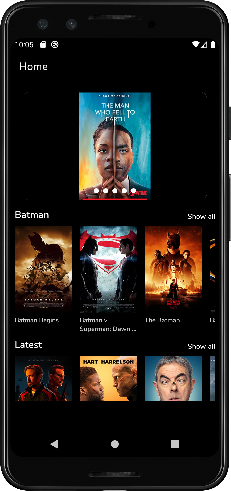
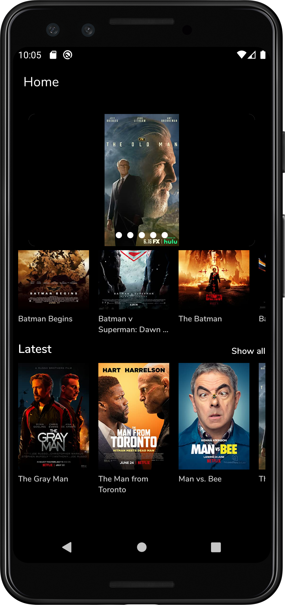
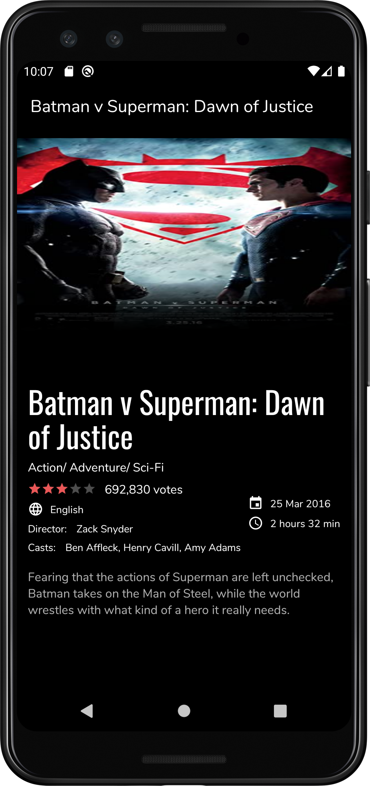
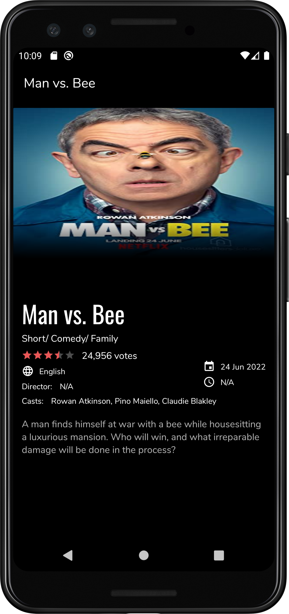
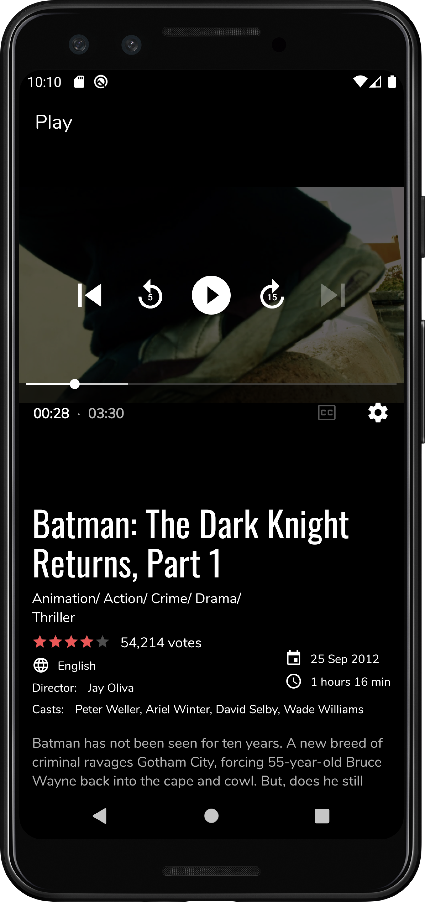
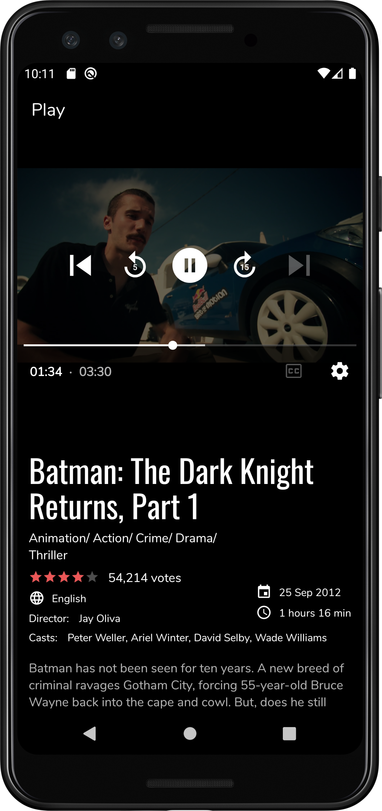

# ToffeeLite
ToffeeLite is a android application that shows list of movies from omdb api &amp; their details 

## Introduction
This is a demo application built with the goal to create a fun application based on the MVVM architectural pattern using [OMDB](https://www.omdbapi.com/)
according to the instruction of the programming test.

See below for more information.

## Technologies & Architecture 

#### Technologies
* Android, Kotlin
* [OMDB](https://www.themoviedb.org/)
* [Retrofit HTTP Client](https://square.github.io/retrofit/) 
* [OkHttp](https://square.github.io/okhttp/) - Interceptor
* [Picasso](https://square.github.io/picasso/) - Loading images, caching
* [ExoPlayer](https://exoplayer.dev/) - playing Vide
* [Bitmovin](https://bitmovin.com/) - getting streaming url 

#### Architecture
Model-View-ViewModel (MVVM)

#### Architecture Components
[ViewModel](https://developer.android.com/topic/libraries/architecture/viewmodel),
[LiveData](https://developer.android.com/topic/libraries/architecture/livedata),
[DataBinding](https://developer.android.com/topic/libraries/data-binding), 
[Navigation](https://developer.android.com/guide/navigation/)

## Features
**Home:** Carousel with 5 random latest movie(implemented with a randomized algorithim), Lists of favourite (for this programming test it's BATMAN) and latest movies

**Show all:** Show movie list based on type (favourite, latest)

**Movie details:** Title, genres, rating, overview, date, runtime, language, video, and cast

**General:** Infinite scrolling lists, Video player, error messages with snackbar, progress bar

## Screenshots

   &emsp; &emsp; &emsp; 
   &emsp; &emsp; &emsp;
   

### Movie | Carousel | Favourite(Batman) | Latest| Details | Player

   &emsp; &emsp; &emsp; 
   &emsp; &emsp; &emsp; 
   

## Note
##### For carousel I have implemented an algorithm that collects poster from latest movies & shows five images randomly 
##### For saving the state of video player I have used sharedpreference to store the lastest playback session 

## Setup

#### Requirements

#### The Open Movie Database API
1. Sign up and retrieve a API key from [The OPEN Movie Database API](https://www.omdbapi.com/apikey.aspx) 

#### Project
1. Download and open the project in Android Studio
2. Edit the file local.properties and add the line: omdb_api_key="YOUR_KEY"
3. Connect your Android phone or use the emulator to start the application

